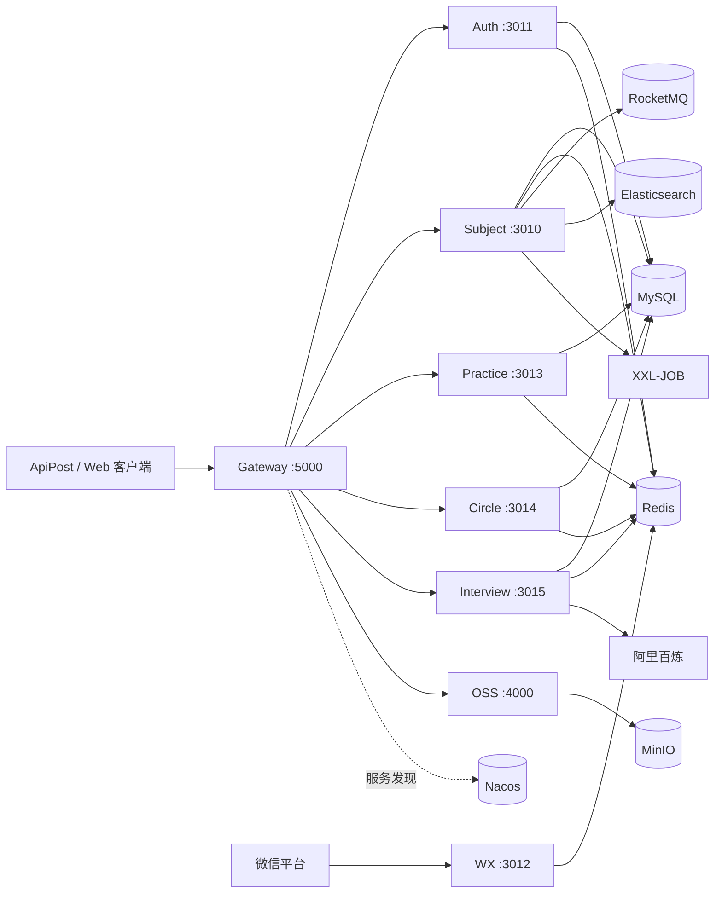
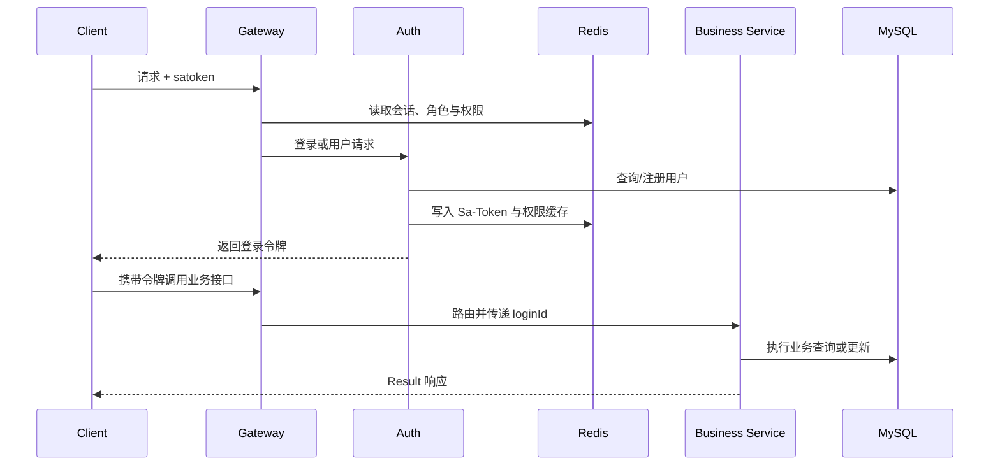

# DYH Interview Club

DYH Interview Club 是一个面向技术面试练习场景的 Java 微服务项目，覆盖题目管理、专项练习、模拟面试、用户与权限、交流圈、对象存储和微信回调等能力。项目采用分层领域结构，并通过网关与服务注册发现组织多个 Spring Boot 应用。

## 核心功能

- 题目分类、标签、题型、检索、点赞与贡献记录
- 专项练习、答题提交、成绩报告、排行与未完成练习
- 模拟面试、题目生成、评分与面试历史
- 用户、角色、权限、Sa-Token 会话与 Redis 权限缓存
- 交流圈、动态、评论、消息和敏感词管理
- MinIO/对象存储文件上传与访问地址生成
- 微信公众号回调验签与消息处理
- Spring Cloud Gateway 统一入口

## 技术栈

- Java 8 语法级别，Maven 多模块构建
- Spring Boot 2.3.x–2.4.2、Spring Cloud 2020.0.6、Spring Cloud Alibaba 2021.1
- MyBatis-Plus、MySQL 8、Druid
- Redis、Sa-Token
- Nacos、Spring Cloud Gateway、OpenFeign
- RocketMQ、Elasticsearch、XXL-JOB
- MinIO、微信公众号回调、阿里百炼接口
- Lombok 1.18.46、MapStruct 1.4.2.Final

## 系统架构



## 核心请求调用链



## 项目结构

```text
dyh-interview-club/
├─ db/                         # 幂等 schema 与匿名演示数据
├─ docs/                       # 接口、验证记录和截图目录
├─ dyh-club-auth/              # 用户、角色、权限、认证
├─ dyh-club-subject/           # 题目领域服务
├─ dyh-club-practice/          # 练习服务
├─ dyh-club-circle/            # 交流圈服务
├─ dyh-club-interview/         # 模拟面试服务
├─ dyh-club-oss/               # 对象存储服务
├─ dyh-club-wx/                # 微信回调服务
├─ dyh-club-gateway/           # API 网关
├─ compose.yaml                # MySQL 与 Redis 本地依赖
└─ pom.xml                     # 统一聚合构建入口
```

## 环境要求

- JDK 8 或更高版本；本项目已在 JDK 25 上完成兼容构建和运行验证
- Maven 3.8+
- MySQL 8.x、Redis 6+
- Docker Desktop（可选，用于快速启动 MySQL/Redis）
- 完整微服务联调还需要 Nacos、RocketMQ、Elasticsearch、XXL-JOB 和 MinIO

## 环境变量

复制 [.env.example](.env.example) 为 `.env`，并在本机填写真实值。`.env` 已被 Git 忽略。

| 变量 | 用途 | 默认/要求 |
| --- | --- | --- |
| `MYSQL_HOST` / `MYSQL_PORT` | MySQL 地址 | `localhost:3306` |
| `MYSQL_DATABASE` | 数据库名 | `dyh_club` |
| `MYSQL_USERNAME` / `MYSQL_PASSWORD` | 应用数据库账号 | 密码必须自行配置 |
| `REDIS_HOST` / `REDIS_PORT` / `REDIS_PASSWORD` | Redis 连接 | 本地默认无密码 |
| `AUTH_PASSWORD_SALT` | 注册密码摘要盐 | 生产环境必须替换 |
| `NACOS_CONFIG_ENABLED` / `NACOS_DISCOVERY_ENABLED` | Nacos 配置与发现开关 | 本地默认 `false` |
| `NACOS_SERVER_ADDR` | Nacos 地址 | `localhost:8848` |
| `MINIO_URL` / `MINIO_ACCESS_KEY` / `MINIO_SECRET_KEY` | 对象存储 | 使用 OSS 服务时必填 |
| `ALIYUN_BAILIAN_API_KEY` | AI 面试引擎 | 使用阿里百炼时必填 |
| `WECHAT_CALLBACK_TOKEN` | 微信回调验签 | 使用微信回调时必填 |
| `ROCKETMQ_NAME_SERVER` | RocketMQ NameServer | `localhost:9876` |
| `ELASTICSEARCH_NODES` | Elasticsearch 节点 | `localhost:9200` |
| `XXL_JOB_ACCESS_TOKEN` | XXL-JOB 访问令牌 | 按部署环境填写 |

完整清单见 [.env.example](.env.example)。不要提交 `.env`、密钥、授权码或生产证书。

## 数据库初始化

发布脚本不会删除已有数据库或表：

- [db/schema.sql](db/schema.sql)：`CREATE DATABASE/TABLE IF NOT EXISTS`，不含 `DROP`。
- [db/demo-data.sql](db/demo-data.sql)：匿名演示数据，使用 `INSERT IGNORE`，可重复执行。

使用 MySQL CLI：

```bash
mysql -u root -p < db/schema.sql
mysql -u root -p < db/demo-data.sql
```

也可用 Docker Compose。首次启动时脚本会自动执行：

```bash
copy .env.example .env
docker compose up -d mysql redis
```

如果数据库已存在，Docker 的初始化目录不会再次执行；此时请手动运行上面的两个 SQL 文件。不要对生产库直接执行演示数据脚本。

## 构建与本地启动

全量构建：

```bash
mvn clean package
```

只启动认证服务进行最小验证：

```bash
java -jar dyh-club-auth/dyh-club-auth-starter/target/dyh-club-auth-starter.jar
```

其他可执行 Jar 位于各服务的 `target` 目录。默认端口为：Subject `3010`、Auth `3011`、WX `3012`、Practice `3013`、Circle `3014`、Interview `3015`、OSS `4000`、Gateway `5000`。

本地单服务调试可保持 Nacos 开关为 `false`。通过网关完成多服务联调时，需要启动 Nacos、将两个 Nacos 开关设为 `true`，再启动业务服务和 Gateway。

## 核心接口

| 服务 | 接口 | 说明 |
| --- | --- | --- |
| Auth | `POST /user/doLogin?validCode=...` | 使用 Redis 中的临时验证码登录并签发 Sa-Token |
| Auth | `POST /user/getUserInfo` | 查询用户信息 |
| Subject | `POST /subject/getSubjectPage` | 题目分页 |
| Subject | `POST /subject/querySubjectInfo` | 题目详情 |
| Practice | `GET /practice/set/getSpecialPracticeContent` | 专项练习目录 |
| Practice | `POST /practice/detail/submitSubject` | 提交单题答案 |
| Circle | `GET /circle/share/circle/list` | 圈子列表 |
| Interview | `POST /interview/start` | 开始模拟面试 |
| Interview | `POST /interview/getHistory` | 面试历史 |
| OSS | `POST /upload` | 上传文件 |
| WX | `GET/POST /callback` | 微信回调验签与消息处理 |

完整 Controller 接口与 ApiPost/cURL 示例见 [docs/api-testing.md](docs/api-testing.md)。

## ApiPost / cURL 最小测试

认证服务启动后可直接查询演示用户：

```bash
curl -X POST "http://localhost:3011/user/getUserInfo" \
  -H "Content-Type: application/json" \
  -d '{"userName":"demo-user"}'
```

练习与圈子只读接口：

```bash
curl "http://localhost:3013/practice/set/getSpecialPracticeContent"
curl "http://localhost:3014/circle/share/circle/list"
```
