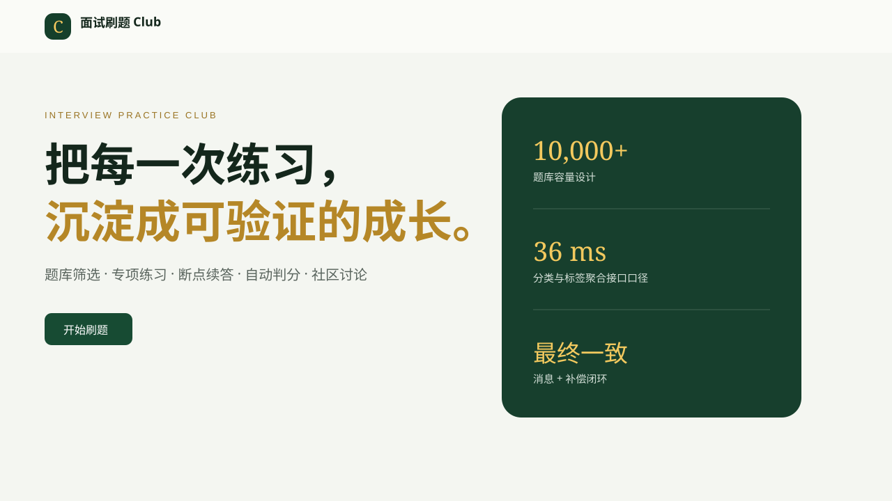
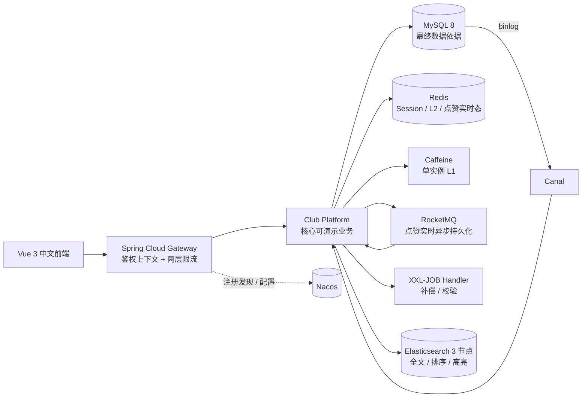
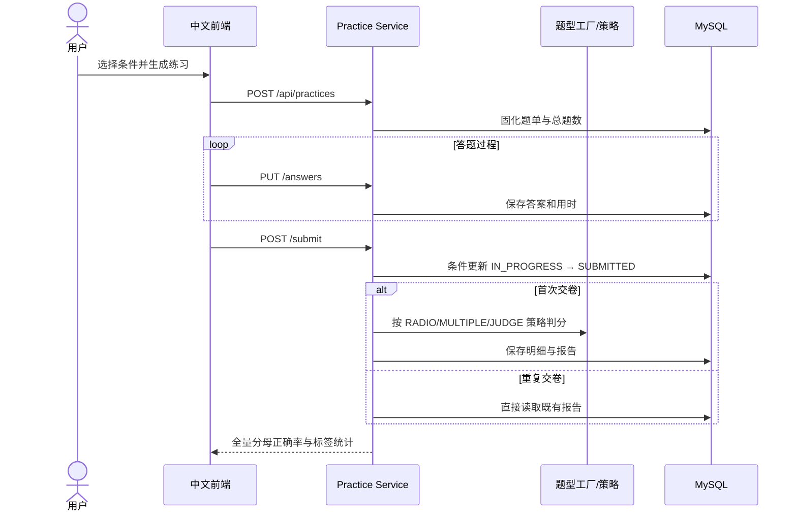
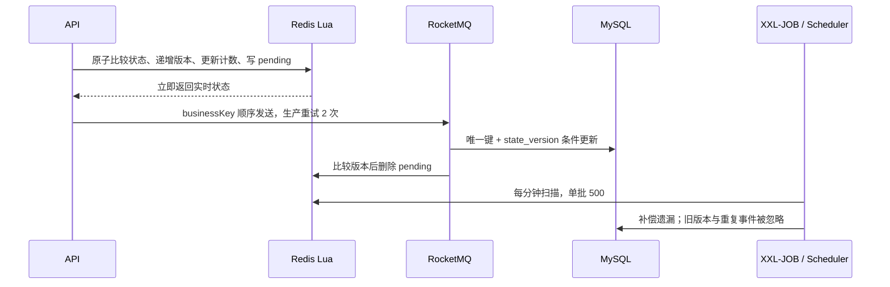

# 面试刷题 Club

面向 Java 求职者的完整刷题与交流平台：从题库检索、专项练习、断点续答和自动判分，到帖子评论、实时点赞、内容治理与管理后台，均提供可运行接口、简体中文页面、版本化数据迁移和自动化测试。项目重点不是堆叠组件名，而是用缓存、消息、补偿、搜索同步和多实例治理形成可验证的工程闭环。

> 本地演示入口：`http://localhost:8088`　管理员：`club-admin / Club@123`　普通用户：`club-user / Club@123`。这些是公开的本地开发凭证，禁止用于生产环境。



## 你可以演示什么

1. 登录后在题库按名称搜索，查看 Elasticsearch 高亮；关闭 ES 后可观察受限 MySQL 名称查询降级。
2. 生成专项练习，逐题保存答案，刷新后从“未完成练习”恢复，交卷后查看正确率和标签薄弱项；重复交卷不会重复判分。
3. 发布帖子、一级评论和多级回复；首屏每条评论只预览 3 条回复，更多回复按页懒加载。
4. 点赞或取消点赞；Redis Lua 原子更新实时状态与计数，RocketMQ 异步落库，XXL-JOB/内置调度补偿遗漏。
5. 管理员维护题目、分类、标签、题型、帖子、评论和敏感词；词库热更新后，后台任务分批复检存量内容。
6. 打开“技术面板”，查看来自真实接口的请求量、平均耗时、P95、错误率、JVM、线程池、连接池、Redis、Caffeine、待处理点赞、任务和搜索状态。

## 架构



核心展示业务位于 `dyh-club-platform`，复用原仓库的微服务与 Gateway，而不是删除旧模块。这样既保留原有领域拆分，又提供一条无需逐个启动旧服务即可验证的完整业务链。`dyh-club-lock-spring-boot-starter` 是被缓存重建和搜索校验真实调用的通用组件。

### 模块

| 模块 | 职责 |
| --- | --- |
| `dyh-club-web` | Vue 3 + TypeScript 中文 SPA，真实调用后端接口 |
| `dyh-club-gateway` | 统一入口、Sa-Token 身份上下文、防伪造用户头、全局与用户/IP 两层限流 |
| `dyh-club-platform` | 认证、题库、练习、社区、点赞、敏感词、搜索、管理端和运维面板 |
| `dyh-club-lock-spring-boot-starter` | 属性绑定、条件装配、默认 Bean、AOP、Redis NX 加锁与 Lua 安全释放 |
| `dyh-club-auth/subject/practice/circle/...` | 原有微服务实现，保留并可继续独立部署 |
| `db` / `deploy` | 旧库兼容脚本、容器初始化和 Canal 复制账号 |

## 核心链路

### 专项练习与交卷



### 点赞最终一致性



### 缓存与搜索

- 题目详情：Caffeine 30 秒 → Redis `600 + [0,120]` 秒 → MySQL；不存在值缓存 120 秒。
- 热点回源：Starter 分布式锁使用唯一持有者、5 秒租期和 Lua compare-and-delete；数据库条件更新、唯一约束和消息版本仍负责最终正确性。
- 写操作：事务中记录缓存失效任务；提交后删除 Redis 并通过 Pub/Sub 通知所有实例清理本地缓存。失败任务由调度器重试，TTL 是最终兜底。
- 搜索：Canal 消费 MySQL ROW binlog，按题目 ID 重建文档；重复事件天然覆盖，失败批次 rollback。每 10 分钟校验漏同步；全量重建写新索引后原子切别名，旧索引可用于回退。
- Elasticsearch 不可用时只开放前 5 页、每页最多 20 条的 MySQL 名称查询，并在响应中明确 `source=MYSQL_LIMITED` 与 `degraded=true`。

## 数据模型

| 领域 | 主要表 | 关键约束 |
| --- | --- | --- |
| 认证 | `club_user` | 用户名唯一、BCrypt 密码摘要、角色与状态 |
| 题库 | `club_question`、`club_question_option`、`club_question_brief` | 题型策略、数据版本、题目与选项唯一键 |
| 目录 | `club_category`、`club_label`、两张映射表 | 分类/标签筛选索引、组合唯一约束 |
| 练习 | `club_practice`、`club_practice_question` | 用户归属、题单唯一、条件交卷与版本号 |
| 社区 | `club_circle`、`club_post`、`club_comment` | 根评论/父评论索引、逻辑状态、计数维护 |
| 点赞 | `club_question_like` | `(question_id,user_id)` 唯一，`state_version` 防重与防乱序 |
| 治理 | `club_sensitive_word`、`club_content_recheck_task` | 黑白名单、词典版本、复检游标 |
| 可靠性 | `club_cache_invalidation_task`、`club_job_run`、`club_search_checkpoint` | 可恢复任务、最近执行证据、同步位置 |

Flyway 迁移位于 `dyh-club-platform/src/main/resources/db/migration`。迁移只向前执行，不依赖手工删表。

## 统一工程口径

- 聚合查询专用线程池：核心 16、最大 32、队列 200、`CallerRunsPolicy`；分支超时 300 ms，总超时 500 ms。
- Web 容器：最小线程 20、最大 200、等待队列 100；Hikari 最大连接 40、连接等待 2 秒。
- Gateway 全局限流：登录 20/s、搜索 200/s、交卷 30/s、点赞 100/s；用户/IP 限流分别为登录 5/min、搜索 10/s、交卷 1/s、点赞 2/s。
- RocketMQ：生产失败重试 2 次、消费最大重试 5 次、业务键定队列、消费线程上限 4；pending 超过 5000 条或最老记录超过 2 分钟触发面板告警，管理员受控恢复单批最多 100 条。
- 搜索索引：1 个主分片、1 个副本，推荐 3 节点；同步目标 5 秒内，校验周期 10 分钟，批量恢复 500 条。
- 评论：根评论每页 20 条、首屏回复预览 3 条、回复懒加载每页 20 条；敏感词复检每批 500 条。
- 简历中的 `185 ms → 36 ms、P95 260 ms → 68 ms、错误率 <0.1%` 仅指分类与标签聚合接口在 4C8G、100 并发口径下的历史压测结果，不代表全系统提升 80%。复测脚本见 `scripts/load-test.ps1`。

## 快速启动

要求：Docker Desktop 24+（建议 6 GB 可用内存）。

```powershell
Copy-Item .env.example .env
docker compose up -d --build mysql redis platform gateway web
docker compose ps
```

等待所有健康检查通过后访问 `http://localhost:8088`。基础模式使用 MySQL、Redis、Gateway、后端和前端；搜索会明确展示 MySQL 降级状态，点赞在 Redis 不可用时也会安全降级为数据库条件写入。

完整中间件环境：

```powershell
# 在 .env 中将 ROCKETMQ_ENABLED、ELASTICSEARCH_ENABLED、CANAL_ENABLED 设为 true
docker compose --profile full up -d --build
```

完整模式额外启动 Nacos、RocketMQ、3 节点 Elasticsearch 和 Canal。XXL-JOB 的 handler 已注册，同时保留同周期 Spring Scheduler 作为本地无调度中心时的可运行入口；接入已有 XXL-JOB Admin 时设置 `XXL_JOB_ENABLED=true` 和对应地址即可。

停止服务不会删除数据：

```powershell
docker compose down
```

仅在明确需要清空本地演示数据时执行 `docker compose down -v`。

### 非 Docker 开发

```powershell
# 后端
$env:SPRING_PROFILES_ACTIVE="demo"
mvn -pl dyh-club-platform -am -DskipTests package
java -jar dyh-club-platform/target/dyh-club-platform-1.0-SNAPSHOT.jar

# 网关（另一终端）
mvn -f dyh-club-gateway/pom.xml spring-boot:run

# 前端（另一终端）
cd dyh-club-web
npm ci
npm run dev
```

生产环境必须通过环境变量或配置中心提供数据库、Redis 和第三方凭证；仓库中的默认密码仅用于不可路由的本地容器网络。

## 测试与验证

```powershell
# 全量 Maven reactor 编译与测试
mvn clean test

# 核心集成测试
mvn -pl dyh-club-platform -am test

# 前端检查
cd dyh-club-web
npm ci
npm run typecheck
npm run lint
npm run build

# Compose 静态校验
docker compose config --quiet
docker compose --profile full config --quiet
```

集成测试覆盖 Flyway、注册/登录/退出与权限、题目 CRUD、题型策略、缓存对象隔离和失效任务、断点续答、条件交卷、评论预览/懒加载、点赞重复/乱序与降级、敏感词干扰字符/热更新、搜索降级和真实面板。详细结果、证据与故障演练见 [工程验证记录](docs/verification.md)、[工程证据矩阵](docs/engineering-evidence.md) 和 [运维与故障演练](docs/operations.md)。

## 安全与配置

- `.env`、证书、日志、构建目录和依赖目录均被 Git 忽略；`.env.example` 只含本地公开示例值。演示账号和演示题目仅在 `demo` 配置或测试环境创建，生产环境默认关闭。
- 前端传入的 `loginId` 会被 Gateway 删除，只允许网关从 Sa-Token 会话重新注入；服务内部仍校验登录和资源归属，避免绕过与越权。
- 密码使用 BCrypt；异常响应只返回中文安全信息与 TraceId，不返回堆栈、SQL 或内部地址。
- 所有写入请求执行格式、长度、状态与归属校验；数据库唯一约束和条件更新抵御重复请求。
- Actuator 只开放健康、指标和 Prometheus；面板不返回凭证、完整连接地址或危险管理操作。

## 常见故障

| 现象 | 自动行为 | 排查入口 |
| --- | --- | --- |
| Redis 短时不可用 | 题目回源 MySQL；点赞降级条件写库；Session 新请求失败但不泄露数据 | 技术面板 Redis 状态、应用 TraceId |
| Elasticsearch 不可用 | 前 5 页、每页 20 条的 MySQL 名称查询 | 响应 `degraded`、搜索状态与 checkpoint |
| MQ 发送失败 | pending 保留，补偿任务再次落库 | pending 数量、`club_job_run`、积压阈值 |
| 缓存失效发布失败 | 失效任务转 RETRY，后台重试，TTL 兜底 | `club_cache_invalidation_task` |
| Canal 批次异常 | 不 ack 并 rollback；恢复后重放 | `club_search_checkpoint.last_error` |
| 聚合子查询超时 | 单分支标记 `degraded`，不拖垮总接口 | 线程池队列、TraceId、请求 P95 |

更多命令、恢复步骤、别名回退和多实例检查见 [docs/operations.md](docs/operations.md)。

## 仓库约定

- 所有用户可见页面、错误、空状态和确认信息均为简体中文。
- 演示数字来自接口或明确标注的容量/压测口径，不把测试数据描述为生产数据。
- 当前 Club 模拟面试题库、审查清单和简历是只读参考资料，未被复制进仓库或修改。
- 许可证和第三方组件版本以各模块 `pom.xml`、`package-lock.json` 和容器镜像标签为准。
